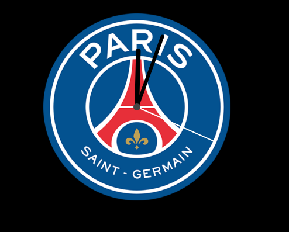
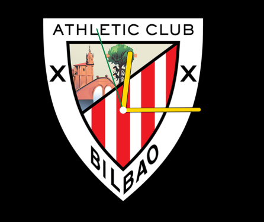
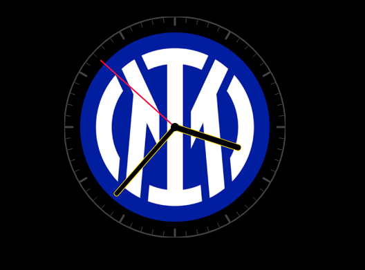

# MMM-MyTeams-Clock

A MagicMirror² module that overlays a customizable analog clock on top of a football club crest. Works best with circular crests but can cope with non-circular / non-square crest images by masking them in a circular or square container while rendering the clock precisely centered on top. Some user tweaking of the config offsets may be required to align the clock face on irregular shaped crests or if you want the clockface inside the crest rather than aligned to or outside of the circular crest circumfrance.

## Features
- **Crest rendered as a perfect circle**: Background-image masked to circle (no distortion)
- **Overlay analog clock**: Adjustable clock radius and colors
- **Customizable clock hands**: Fully customizable hour and minute hands with border color, border width, and border radius options
- **Wrapper size control**: Default wrapper size is 2 × maximnm (crestRadius or clockRadius) × wrapperSizeFactor.  
- **HiDPI/Retina sharpness**: Canvas scaled by devicePixelRatio
- **User-configurable wrapper offsets**: Move the entire module wrapper by X/Y, with optional clamping
- **Optional debug outline**: Helps to visulise how to align the module by placing a tempoary border around the wrapper area
- **Toggleable decorations**: Hide/show rim and hour/minute marks - usefull for non circular crests when sometimes the marks dont look just right.  

## Screenshots
| Screenshot 1 | Screenshot 2 | Screenshot 3 |
|:---:|:---:|:---:|

  

| Screenshot 1 | Screenshot 2 | Screenshot 3 |
|:---:|:---:|:---:|

  


## Club Crests Database

This module now includes an extensive database of **480+ football club crests** covering teams from over **50 countries**, with **92.6% database coverage** of major football leagues:

### Included Crests by Region

- **Scottish Premiership**: Celtic, Rangers, Aberdeen, Hearts, Hibernian, Kilmarnock, Livingston, Motherwell, St Mirren, Dundee, Dundee United, and more
- **English Premier League**: Manchester United, Manchester City, Liverpool, Newcastle, Arsenal, Chelsea, and others
- **German Bundesliga**: Bayern München, Borussia Dortmund, and others
- **Spanish La Liga**: Barcelona, Real Madrid, and others
- **Italian Serie A**: AC Milan, Inter Milan, and others
- **European Cups**: Ajax, Club Brugge, Red Bull Salzburg, Slovan Bratislava, Boavista, and many more
- **International Leagues**: Teams from Czech Republic, Poland, Croatia, Portugal, Denmark, Sweden, Iceland, and beyond

The crests libary is found in the `images/crests/` folder organised by Country. Crest to be displayed by the module must be copied to the `clubCrest/` folder  for easy selection in your config by filename. Most crests are high-quality PNG/JPG images that work perfectly with both the circular and square masking.

## Installation

1. Navigate to your MagicMirror modules folder:
   ```bash
   cd ~/MagicMirror/modules
   ```
2. Clone or copy this module into `MMM-MyTeams-Clock`:

   ```bash
   git clone https://github.com/gitgitaway/MMM-MyTeams-Clock
   ```
   
3. Ensure a copy of the crest(s) you wish to display are copied to the `clubCrest/` folder. For example, if you want to display Celtic FC's crest, ensure it  placed in the `clubCrest` folder. 
4. Add the module to your MagicMirror `config/config.js` (see example below).

## Configuration

### Minimal Configuration

For a quick setup with just your club crest and clock, use this minimal config, and customise the hand colours as you require:

```js
{
  module: "MMM-MyTeams-Clock",
  position: "top_center",
  config: {
    crestImage: "Celtic.png",    // Your club crest filename from clubCrest folder
    crestRadius: 160,            // Crest size in CSS px
    clockRadius: 160,
    hourHandColor: "#ffffff",
    minuteHandColor: "#ffffff",
    secondHandColor: "#f144bdd8",
    centerDotColor: "#018749"             // Clock overlay size
  }
}
```

### Full Configuration

Add to your `config/config.js` with all available options:

```js
{
  module: "MMM-MyTeams-Clock",
  position: "top_center",
  config: {
    // Basic settings
    crestImage: "Celtic.png",   // file name in this module's clubCrest folder e.g "Celtic.png", "liverpool.png" , "Rangers.png" etc
    crestRadius: 160,              // crest radius in CSS px (canvas footprint is 2 × crestRadius)
    clockRadius: 100,              // clock radius (adjust until perfectly aligned)
    wrapperSizeFactor: 1.0,        // wrapper square min size factor: crestRadius × factor (wrapper also enforces ≥ 2 × crestRadius)

    // Internal canvas offsets (fine-tune clock center over crest)
    offsetX: 0,                    // px
    offsetY: 0,                  // px (negative values move up)

    // Wrapper position offsets (move whole module)
    wrapperOffsetX: 0,             // px (positive → right, negative → left)
    wrapperOffsetY: 0,             // px (positive → down, negative → up)
    clampWrapperOffsets: false,    // when true, clamp wrapper offsets to ±clampMaxAbsOffset
    clampMaxAbsOffset: 2000,       // clamp magnitude if clamping is enabled

    // Optional debug aids
    debugOutline: false,           // draw an outline around the wrapper
    debugOutlineColor: "#ff00ff",
    debugOutlineWidth: 1,

    // Colors - change to match your club crest colours
    rimColor: "#444444",
    hourMarkColor: "#444444",
    minuteMarkColor: "#444444",
    hourHandColor: "#018749",
    minuteHandColor: "#018749",
    secondHandColor: "#ffffff",
    centerDotColor: "#018749",
    
    // Hour hand border customization (set borderColor to null to disable border)
    hourHandBorderColor: "#ffffff",  // Border color for hour hand (null = no border)
    hourHandBorderWidth: 2,          // Border line weight in pixels
    hourHandBorderRadius: true,      // Enable rounded ends for hour hand border
    
    // Minute hand border customization (set borderColor to null to disable border)
    minuteHandBorderColor: "#ffffff", // Border color for minute hand (null = no border)
    minuteHandBorderWidth: 2,         // Border line weight in pixels
    minuteHandBorderRadius: true,     // Enable rounded ends for minute hand border

    // Visual toggles
    showRim: true,                 // set false to hide the outer rim - usefull for non circular crests if the marks dont look right
    showMarks: true,               // set false to hide both hour and minute marks

    // Crest appearance
    opacity: 1.0,                  // 0.0–1.0 opacity for the crest only
    
    // Theme overrides
    darkMode: null,                // null=auto, true=force dark, false=force light
    fontColorOverride: null,       // e.g., "#FFFFFF" to force white text
    opacityOverride: null          // e.g., 1.0 to force full opacity
  }
}
```

### Config Options

| Option               | Type      | Default        | Description |
|----------------------|-----------|----------------|-------------|
| **Basic Settings** |
| crestImage           | string    | "Celtic-01.png" | File name of the crest image in `clubCrest` folder. |
| crestRadius          | number    | 260            | Crest (and canvas) radius in CSS px. Canvas is 2 × crestRadius. |
| clockRadius          | number    | 100            | Radius of the analog clock overlay. |
| wrapperSizeFactor    | number    | 1.0            | Wrapper min square size = crestRadius × factor; wrapper size is also ≥ 2 × crestRadius. |
| **Clock Positioning** |
| offsetX              | number    | 0              | Fine-tunes internal clock drawing X offset (px). |
| offsetY              | number    | -17            | Fine-tunes internal clock drawing Y offset (px). |
| wrapperOffsetX       | number    | 0              | Moves the entire module wrapper horizontally (px). |
| wrapperOffsetY       | number    | 0              | Moves the entire module wrapper vertically (px). |
| clampWrapperOffsets  | boolean   | false          | Clamp wrapper offsets within ±clampMaxAbsOffset. |
| clampMaxAbsOffset    | number    | 2000           | Maximum absolute offset when clamping is enabled. |
| **Debug Options** |
| debugOutline         | boolean   | false          | Draw an outline around the wrapper for visual alignment. |
| debugOutlineColor    | string    | "#ff00ff"      | Outline color when `debugOutline` is true. |
| debugOutlineWidth    | number    | 1              | Outline width in px when `debugOutline` is true. |
| **Clock Colors** |
| rimColor             | string    | "#444444"      | Rim color. |
| hourMarkColor        | string    | "#444444"      | Hour mark color. |
| minuteMarkColor      | string    | "#444444"      | Minute mark color. |
| hourHandColor        | string    | "#018749"      | Hour hand color. |
| minuteHandColor      | string    | "#018749"      | Minute hand color. |
| secondHandColor      | string    | "#ffffff"      | Second hand color. |
| centerDotColor       | string    | "#018749"      | Center dot fill color. |
| **Clock Hand Borders** |
| hourHandBorderColor  | string/null | null         | Border color for hour hand (null = no border). |
| hourHandBorderWidth  | number    | 2              | Border line weight in pixels for hour hand. |
| hourHandBorderRadius | boolean   | true           | Enable rounded ends for hour hand border. |
| minuteHandBorderColor | string/null | null        | Border color for minute hand (null = no border). |
| minuteHandBorderWidth | number   | 2              | Border line weight in pixels for minute hand. |
| minuteHandBorderRadius | boolean | true           | Enable rounded ends for minute hand border. |
| **Visual Toggles** |
| showRim              | boolean   | true           | Show or hide the clock rim. |
| showMarks            | boolean   | true           | Show or hide hour and minute marks. |
| opacity              | number    | 1.0            | Crest background opacity (0.0–1.0). |
| **Theme Overrides** |
| darkMode             | boolean/null | null        | null=auto-detect, true=force dark mode, false=force light mode. |
| fontColorOverride    | string/null | null        | Override font/text color (e.g., "#FFFFFF" for white text). Set to null for default. |
| opacityOverride      | number/null | null        | Override crest opacity (0.0–1.0). Set to null to use opacity setting. |

## Notes and Tips
- If your crest appears off-center under the clock, start by adjusting `offsetY` (and `offsetX` if needed).
- If the whole module is positioned slightly off in your region, use `wrapperOffsetX/Y`.
- Non-square crest images are supported; the circular mask ensures a clean round crest.
- The wrapper size will always be at least 2 × crestRadius to fully contain the crest footprint.
- **Clock hand borders**: Add visual depth to your clock hands by setting `hourHandBorderColor` and `minuteHandBorderColor` to create outlined hands. Set to `null` to disable borders. Adjust `borderWidth` to control the outline thickness, and use `borderRadius` to toggle rounded or square ends.

## Compatibility
- MagicMirror² v2.x
- Modern browsers (as used by MagicMirror Electron)

## Dependencies
- None (uses standard browser canvas API).

## Updating
```bash
cd ~/MagicMirror/modules/MMM-MyTeams-Clock
git pull
```

## Development
- Source:
  - `MMM-MyTeams-Clock.js` — main view logic and drawing
  - `MMM-MyTeams-Clock.css` — base styles
  - `clubCrest/` — crest images
- Helpful debug settings: set `debugOutline: true` and tweak `wrapperOffsetX/Y` during alignment.

## TODO
- [x] Add wrapper translate offsets (X/Y) with validation/clamping
- [x] Add toggles to hide rim and hour/minute marks
- [x] Add customizable clock hand borders with color, width, and radius options
- [x] Add additional club crests
- [ ] Add digital time overlay option
- [ ] Add auto-scaling to fit region constraints

## Changelog
- 1.2.1
  - **Expanded club crests database**: Added 184 new football club crests from Wikipedia
  - Database coverage increased from 57.1% to **92.6%** (479 of 517 teams)
  - Now supports **480+ team crests** covering **50+ countries**
  - Improved crest library includes: Scottish Premiership, English Premier League, major European leagues, and international teams
- 1.2.0
  - Added fully customizable clock hand borders for hour and minute hands
  - New config options: `hourHandBorderColor`, `hourHandBorderWidth`, `hourHandBorderRadius`
  - New config options: `minuteHandBorderColor`, `minuteHandBorderWidth`, `minuteHandBorderRadius`
  - Enhanced `drawHand()` function to support border rendering with optional rounded ends
- 1.1.0
  - Wrapper offsets (X/Y), optional clamping, debug outline
  - Added `showRim` and `showMarks` config options
  - Safer numeric handling and wrapper sizing
- 1.0.0
  - Initial draft

-## Notes

This was the 1st module in my Celtic themed man cave magicmirror.  
- 

 The other modules can be found here:- 
- Module 2: MyTeams-LeagueTable  https://github.com/gitgitaway/MMM-MyTeams-LeagueTable
- Module 3: MyTeams-Fixtures https://github.com/gitgitaway/MMM-MyTeams-Fixtures
- Module 4: MyTeams-JukeBox  https://github.com/gitgitaway/MMM-JukeBox
---
## Acknowledgments
Thanks to the MagicMirror community for inspiration and guidance! Special thanks to all those who have produced such great clock modules which inspired me to have a go. 

## Credits
- Club crests are property of their respective owners; included images are for demonstration.

## License
MIT License 


