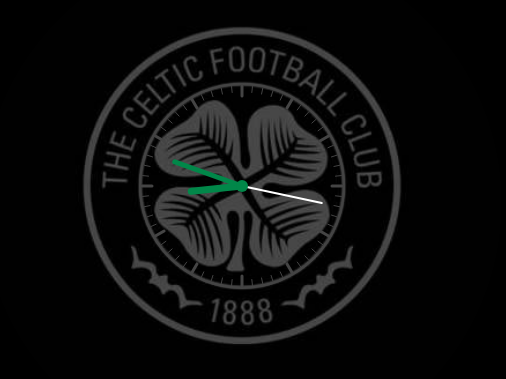

# MMM-MyTeams-Clock

A MagicMirror² module that overlays a customizable analog clock on top of a football club crest. Works best with circular crests but can cope with non-cirvular / non-square crest images by masking them in a circular container while rendering the clock precisely centered on top. Some user tweaking of the config offsets may be required to align the clock face on irregular shaped crests or if you want the clockface inside the crest rather than aligned yo the circular crst circumfrance.

This is my first module and will be 1 of 4 Celtic themed modules which Im planning for my man cave`s mirror. The others will posted shortlly once completed. Feel free to adapt these for your own team.  

## Features
- **Crest rendered as a perfect circle**: Background-image masked to circle (no distortion)
- **Overlay analog clock**: Adjustable clock radius and colors
- **Wrapper size control**: Wrapper uses the larger of 2 × crestRadius or crestRadius × wrapperSizeFactor
- **HiDPI/Retina sharpness**: Canvas scaled by devicePixelRatio
- **User-configurable wrapper offsets**: Move the entire module wrapper by X/Y, with optional clamping
- **Optional debug outline**: Helps to visulise how to align the module by placing a tempoary border around the wrapper area
- **Toggleable decorations**: Hide/show rim and hour/minute marks - usefull for non circular crests when sometimes the marks dont look just right.  

## Screenshots

- Clock over crest positioned (example 1)



- Clock over crest (example 2)


- In-Mirror example


## Installation

1. Navigate to your MagicMirror modules folder:
   ```bash
   cd ~/MagicMirror/modules
   ```
2. Clone or copy this module into `MMM-MyTeams-Clock`:

   ```bash
   git clone https://github.com/gitgitaway/MMM-MyTeams-Clock
   ```
   
3. Place your crest image(s) in the module's `clubCrest` folder (e.g., `clubCrest/Celtic-01.png`).
4. Add the module to your MagicMirror `config/config.js` (see example below).

## Configuration

Add to your `config/config.js`:
```js
{
  module: "MMM-MyTeams-Clock",
  position: "top_center",
  config: {
    // Basic
    crestImage: "Celtic-01.png",  // file name in this module's clubCrest folder
    crestRadius: 260,              // crest radius in CSS px (canvas footprint is 2 × crestRadius)
    clockRadius: 100,              // clock radius (adjust until perfectly aligned)
    wrapperSizeFactor: 1.0,        // wrapper square min size factor: crestRadius × factor (wrapper also enforces ≥ 2 × crestRadius)

    // Internal canvas offsets (fine-tune clock center over crest)
    offsetX: 0,                    // px
    offsetY: -17,                  // px (negative values move up)

    // Wrapper position offsets (move whole module)
    wrapperOffsetX: 0,             // px (positive → right, negative → left)
    wrapperOffsetY: 0,             // px (positive → down, negative → up)
    clampWrapperOffsets: false,    // when true, clamp wrapper offsets to ±clampMaxAbsOffset
    clampMaxAbsOffset: 2000,       // clamp magnitude if clamping is enabled

    // Optional debug aids
    debugOutline: false,           // draw an outline around the wrapper
    debugOutlineColor: "#ff00ff",
    debugOutlineWidth: 1,

    // Colors - change to match your club colours
    rimColor: "#444444",
    hourMarkColor: "#444444",
    minuteMarkColor: "#444444",
    hourHandColor: "#018749",
    minuteHandColor: "#018749",
    secondHandColor: "#ffffff",
    centerDotColor: "#018749",

    // Visual toggles
    showRim: true,                 // set false to hide the outer rim - usefull for non circular crests if the marks dont look right
    showMarks: true,               // set false to hide both hour and minute marks

    // Crest appearance
    opacity: 1.0                   // 0.0–1.0 opacity for the crest only
  }
}
```

### Config Options

| Option               | Type      | Default        | Description |
|----------------------|-----------|----------------|-------------|
| crestImage           | string    | "Celtic-01.png" | File name of the crest image in `clubCrest` folder. |
| crestRadius          | number    | 260            | Crest (and canvas) radius in CSS px. Canvas is 2 × crestRadius. |
| clockRadius          | number    | 100            | Radius of the analog clock overlay. |
| wrapperSizeFactor    | number    | 1.0            | Wrapper min square size = crestRadius × factor; wrapper size is also ≥ 2 × crestRadius. |
| offsetX              | number    | 0              | Fine-tunes internal clock drawing X offset (px). |
| offsetY              | number    | -17            | Fine-tunes internal clock drawing Y offset (px). |
| wrapperOffsetX       | number    | 0              | Moves the entire module wrapper horizontally (px). |
| wrapperOffsetY       | number    | 0              | Moves the entire module wrapper vertically (px). |
| clampWrapperOffsets  | boolean   | false          | Clamp wrapper offsets within ±clampMaxAbsOffset. |
| clampMaxAbsOffset    | number    | 2000           | Maximum absolute offset when clamping is enabled. |
| debugOutline         | boolean   | false          | Draw an outline around the wrapper for visual alignment. |
| debugOutlineColor    | string    | "#ff00ff"      | Outline color when `debugOutline` is true. |
| debugOutlineWidth    | number    | 1              | Outline width in px when `debugOutline` is true. |
| rimColor             | string    | "#444444"      | Rim color. |
| hourMarkColor        | string    | "#444444"      | Hour mark color. |
| minuteMarkColor      | string    | "#444444"      | Minute mark color. |
| hourHandColor        | string    | "#018749"      | Hour hand color. |
| minuteHandColor      | string    | "#018749"      | Minute hand color. |
| secondHandColor      | string    | "#ffffff"      | Second hand color. |
| centerDotColor       | string    | "#018749"      | Center dot fill color. |
| showRim              | boolean   | true           | Show or hide the clock rim. |
| showMarks            | boolean   | true           | Show or hide hour and minute marks. |
| opacity              | number    | 1.0            | Crest background opacity (0.0–1.0). |

## Notes and Tips
- If your crest appears off-center under the clock, start by adjusting `offsetY` (and `offsetX` if needed).
- If the whole module is positioned slightly off in your region, use `wrapperOffsetX/Y`.
- Non-square crest images are supported; the circular mask ensures a clean round crest.
- The wrapper size will always be at least 2 × crestRadius to fully contain the crest footprint.

## Compatibility
- MagicMirror² v2.x
- Modern browsers (as used by MagicMirror Electron)

## Dependencies
- None (uses standard browser canvas API).

## Updating
```bash
cd ~/MagicMirror/modules/MMM-MyTeams-Clock
git pull
```

## Development
- Source:
  - `MMM-MyTeams-Clock.js` — main view logic and drawing
  - `MMM-MyTeams-Clock.css` — base styles
  - `clubCrest/` — crest images
- Helpful debug settings: set `debugOutline: true` and tweak `wrapperOffsetX/Y` during alignment.

## TODO
- [x] Add wrapper translate offsets (X/Y) with validation/clamping
- [x] Add toggles to hide rim and hour/minute marks
- [ ] Add digital time overlay option
- [ ] Add auto-scaling to fit region constraints

## Changelog
- 1.1.0
  - Wrapper offsets (X/Y), optional clamping, debug outline
  - Added `showRim` and `showMarks` config options
  - Safer numeric handling and wrapper sizing
- 1.0.0
  - Initial draft

## License
MIT License

## Credits
- Inspired by various MagicMirror clock and logo overlay modules.
- Club crests are property of their respective owners; included images are for demonstration.
